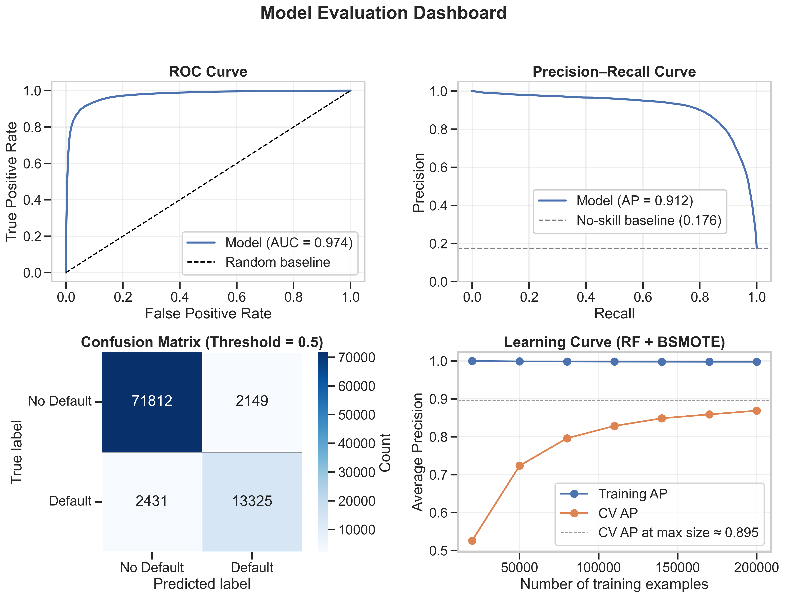

# Loan Default Prediction with Machine Learning

> End-to-end ML pipeline to predict small-business loan defaults on ~900k US SBA loans, from raw CSV → cleaning → EDA → model selection → holdout evaluation.
---

## Snapshot

- **Goal:** Predict whether a loan defaults (`Defaulted` ∈ {0,1}) using borrower + loan attributes.
- **Data:** ~897k historic US Small Business Administration (SBA) loans after cleaning.
- **Best model:** Random Forest with
  - **Weight of Evidence (WoE)** encoding for high-cardinality categorical features
  - **BorderlineSMOTE** oversampling (sampling_strategy = 0.5, m_neighbors = 3)
- **Holdout size:** 89,717 loans never seen during model development.

**Results**

| Metric                | Score  | Interpretation                                      |
|-----------------------|--------|-----------------------------------------------------|
| Average Precision     | 0.912  | Very strong ranking of true defaulters             |
| ROC AUC               | 0.974  | Excellent separation between default / non-default |
| Precision @ 0.5       | 0.861  | 86% of flagged loans actually default              |
| Recall @ 0.5          | 0.846  | Catches ~85% of all defaults                       |
| F1 Score              | 0.853  | Good balance of precision and recall               |
| Accuracy              | 0.949  | 95% overall classification accuracy                |

## Repository structure

> Notebooks (in order):
>`Intro → Cleaning → EDA → Experiments → Final Evaluation`

- `Loan-Default-Pred_0_INTRO.ipynb` – **Project + data introduction**
  - Describes the SBA loan dataset and target (`Defaulted`).

- `Loan-Default-Pred_1_CLEANING.ipynb` – **Data cleaning & export**
  - Handles issues with data entry, dtypes, and leakage
  - Splits the data into dev and holdout sets

- `Loan-Default-Pred_2_EDA.ipynb` – **Exploratory data analysis**
  - Target distribution and default rates across key features.
  - Univariate + bivariate plots:
    - Bar charts / violin plots for categorical vs `Defaulted`
    - Histograms and boxplots for numeric features
    - Correlation heatmap for numerical columns vs `Defaulted`

- `Loan-Default-Pred_3_EXPERIMENTS.ipynb` – **Modeling experiments**
  - Defines a custom `WOEEncoder` and plugs it into a `ColumnTransformer`:
    - Numeric: median imputation + `RobustScaler`
    - Categorical: impute → WoE encode → fill residual NaNs.
  - Builds imbalanced-learning pipelines with:
    - `SMOTE`
    - `BorderlineSMOTE` (BoSMOTE)
    - `RandomUnderSampler` (RUS)
  - Uses `StratifiedKFold` CV and Average Precision as the main model-selection metric.
  - Compares oversampling strategies:
    - Settles on the WoE + Random Forest + BorderlineSMOTE pipeline

- `Loan-Default-Pred_4_EVAL.ipynb` – **Final model & holdout evaluation**
  - Rebuilds the best pipeline with tuned parameters on dev set
  - Evaluates one the holdout set and reports:
    - AP, ROC AUC, Precision, Recall, F1, Accuracy
    - Confusion matrix + classification report
    - Feature importances (with cleaned feature names)
    - ROC & PR curves vs naive baseline
    - Learning curve (AP vs number of training samples)
